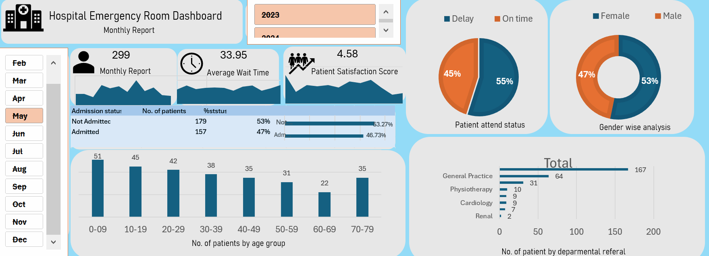

# Hospital Emergency Room Analysis Dashboard - Power BI

## 📌 Project Overview
This Power BI dashboard provides a **comprehensive analysis** of a hospital's emergency room performance, focusing on patient flow, service quality, and operational efficiency.  
It is designed to help hospital administrators, ER managers, and doctors make **data-driven decisions** to improve services.

---

## 🎯 Key Features
- **Number of Patients** – Daily total patient visits with area sparkline trend.
- **Average Wait Time** – Monitors patient waiting periods with daily variation.
- **Patient Satisfaction Score** – Tracks service quality through daily scores.
- **Patient Admission Status** – Admitted vs. Not Admitted breakdown.
- **Patient Age Distribution** – Categorizes patients into age groups.
- **Timeliness** – Percentage of patients attended within 30 minutes.
- **Gender Analysis** – Number of patients by gender.
- **Department Referrals** – Most common referral departments.

---

## 🛠 Data Modeling
### **Calendar Table (Power Query)**
```powerquery
= List.Dates(#date(2023,01,01),731,#duration(1,0,0,0))
```


```powerquery
Age Group =
IF([Patient Age]>=70,"70-79",
IF([Patient Age]>=60,"60-69",
IF([Patient Age]>=45,"45-59",
IF([Patient Age]>=30,"30-44",
IF([Patient Age]>=15,"15-29",
IF([Patient Age]>=5,"05-14","0-4"))))))

```

```powerquery
Patient Attend Status =
IF([Patient Waittime]<30,"Within Time","Delay")
```


## 📊 Tools Used
- **Power BI Desktop** – For building dashboard and DAX measures.
- **Power Query** – For data cleaning and transformation.
- **Excel/CSV** – Sample dataset.
- **DAX** – To create calculated fields and KPIs.

---

## 🔍 Insights
- Peak patient days identified for better staff allocation.
- Longer wait times directly impacted patient satisfaction.
- Younger patients (15–29) are frequent ER visitors.
- Certain departments consistently receive more referrals.

---

## 📁 Files in Repository
- `Hospital_ER_Dashboard.pbix` – Power BI dashboard file.
- `Hospital_ER_Data.xlsx` – Sample dataset.
- `README.md` – Project documentation.

---

## 📷 Dashboard Preview



---

## 🚀 How to Use
1. Download the `.pbix` file from the repository.
2. Open it in **Power BI Desktop**.
3. Connect your own dataset if needed.
4. Refresh data and explore interactive visuals.

